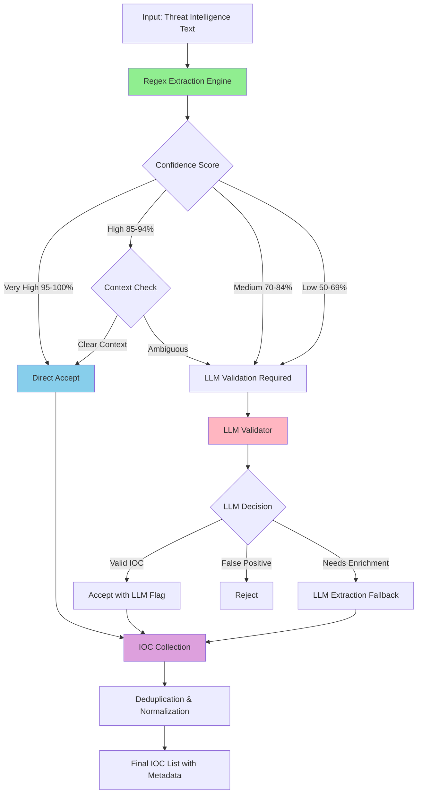

# Hybrid IOC Extraction Architecture

## Overview

This document describes the architecture for a hybrid IOC extraction system that combines regex-based pattern matching with LLM-based validation to optimize performance, reduce costs, and improve accuracy.

## Architecture Diagram



## System Components

### 1. Regex Extraction Engine

**Purpose**: Fast, cost-free extraction of IOCs using pattern matching

**Components**:
- [`RegexIOCExtractor`](backend/extractors/regex_ioc_extractor.py) - Main extraction class
- Pattern library with compiled regex for each IOC type
- Confidence scorer based on pattern characteristics

**Responsibilities**:
- Extract all potential IOCs using regex patterns
- Assign confidence scores based on pattern specificity
- Identify context clues (keywords, section headers, defanging)
- Generate extraction metadata (position, surrounding text)

**Performance Target**:
- Process time: 10-50ms per document
- Extract 80%+ of IOCs without LLM

### 2. Confidence Scoring System

**Purpose**: Determine which IOCs need LLM validation

**Scoring Factors**:

| Factor | Weight | Description |
|--------|--------|-------------|
| Pattern Specificity | 40% | How unique/specific the pattern is |
| Context Keywords | 30% | Proximity to threat-related terms |
| Defanging Markers | 20% | Presence of defanging (hxxp, [.]) |
| Section Location | 10% | Found in IOC/C2 sections |

**Confidence Levels**:

```python
class ConfidenceLevel(Enum):
    VERY_HIGH = (95, 100)  # Direct accept
    HIGH = (85, 94)        # Context check
    MEDIUM = (70, 84)      # LLM validation
    LOW = (50, 69)         # LLM validation + enrichment
```

**Decision Logic**:
```python
if confidence >= 95:
    return "ACCEPT"
elif confidence >= 85:
    if has_clear_context():
        return "ACCEPT"
    else:
        return "LLM_VALIDATE"
else:  # confidence < 85
    return "LLM_VALIDATE"
```

### 3. Context Analyzer

**Purpose**: Analyze surrounding text to improve confidence scoring

**Context Indicators**:

**Positive Indicators** (increase confidence):
- Keywords: "malicious", "C2", "C&C", "IOC", "indicator", "threat"
- Section headers: "Indicators of Compromise", "Network Indicators"
- Defanging markers: `[.]`, `hxxp`, `[@]`, `[dot]`
- Threat actor/malware family names

**Negative Indicators** (decrease confidence):
- Keywords: "example", "tutorial", "documentation", "sample"
- Code block markers (unless marked as malicious)
- Configuration file examples

**Implementation**:
```python
def analyze_context(ioc_value, text, position):
    window = extract_window(text, position, radius=100)
    score = base_confidence
    
    # Check for positive indicators
    for keyword in THREAT_KEYWORDS:
        if keyword in window.lower():
            score += 5
    
    # Check for negative indicators
    for keyword in BENIGN_KEYWORDS:
        if keyword in window.lower():
            score -= 10
    
    return min(100, max(0, score))
```

### 4. LLM Validator

**Purpose**: Validate ambiguous IOCs and extract complex cases

**Validation Modes**:

1. **Quick Validation** (for medium confidence IOCs):
   - Simple yes/no validation
   - Minimal context provided
   - Fast, low-cost LLM calls
   - Batch processing (up to 10 IOCs per call)

2. **Deep Validation** (for low confidence IOCs):
   - Full context analysis
   - Explanation of decision
   - Enrichment with additional context
   - Individual processing

3. **Fallback Extraction** (when regex misses IOCs):
   - Full LLM extraction for specific IOC types
   - Used when regex confidence is very low
   - Triggered by user configuration or detection gaps

**LLM Prompt Strategy**:
```yaml
quick_validation:
  system: "You are an IOC validator. Determine if the following are valid threat indicators."
  user: "Context: {context}\nPotential IOCs: {ioc_list}\nReturn JSON: {\"valid\": [list], \"invalid\": [list]}"
  
deep_validation:
  system: "You are a threat intelligence analyst. Analyze these potential IOCs in context."
  user: "Full context: {full_context}\nIOC: {ioc}\nExplain if this is a valid threat indicator and why."
```

### 5. Hybrid Orchestrator

**Purpose**: Coordinate the extraction workflow

**Workflow**:

```python
class HybridIOCExtractor:
    def extract(self, text: str) -> List[IOC]:
        # Phase 1: Regex extraction
        regex_results = self.regex_extractor.extract_all(text)
        
        # Phase 2: Confidence scoring
        scored_results = self.confidence_scorer.score(regex_results)
        
        # Phase 3: Categorize by confidence
        direct_accept = [r for r in scored_results if r.confidence >= 95]
        needs_context = [r for r in scored_results if 85 <= r.confidence < 95]
        needs_llm = [r for r in scored_results if r.confidence < 85]
        
        # Phase 4: Context analysis for high confidence
        context_analyzed = self.context_analyzer.analyze(needs_context)
        direct_accept.extend([r for r in context_analyzed if r.confidence >= 85])
        needs_llm.extend([r for r in context_analyzed if r.confidence < 85])
        
        # Phase 5: LLM validation (batched)
        llm_validated = self.llm_validator.validate_batch(needs_llm)
        
        # Phase 6: Combine and deduplicate
        all_iocs = direct_accept + llm_validated
        return self.deduplicate(all_iocs)
```

## Data Models

### Enhanced IOC Model

```python
from enum import Enum
from pydantic import BaseModel, Field
from typing import Optional

class ExtractionMethod(str, Enum):
    REGEX = "regex"
    LLM = "llm"
    HYBRID = "hybrid"  # Regex + LLM validation

class IOC(BaseModel):
    type: IOCType
    value: str
    confidence: float = Field(ge=0, le=100)
    extraction_method: ExtractionMethod
    context: Optional[str] = None  # Surrounding text
    position: Optional[int] = None  # Character position in text
    validated_by_llm: bool = False
    llm_explanation: Optional[str] = None
    normalized_value: Optional[str] = None  # Deobfuscated form
```

### Extraction Metrics

```python
class ExtractionMetrics(BaseModel):
    total_iocs: int
    regex_extracted: int
    llm_validated: int
    llm_only: int
    regex_time_ms: float
    llm_time_ms: float
    total_time_ms: float
    cost_estimate: float
    confidence_distribution: Dict[str, int]
```

## Performance Optimization

### Batching Strategy

**Regex Extraction**: Process entire document at once
- Compile all patterns once
- Single pass through text
- Parallel pattern matching where possible

**LLM Validation**: Batch similar IOCs
- Group by IOC type
- Max 10 IOCs per batch
- Parallel batch processing for different types

### Caching Strategy

**Pattern Cache**:
```python
# Compile patterns once at initialization
COMPILED_PATTERNS = {
    IOCType.MD5: re.compile(r'\b[a-fA-F0-9]{32}\b'),
    IOCType.SHA256: re.compile(r'\b[a-fA-F0-9]{64}\b'),
    # ... other patterns
}
```

**LLM Response Cache**:
```python
# Cache LLM validation results
validation_cache = {
    "ioc_value_hash": {
        "is_valid": True,
        "confidence": 95,
        "timestamp": "2024-01-01T00:00:00Z"
    }
}
```

## Configuration

### Extraction Configuration

```python
class HybridExtractionConfig(BaseModel):
    # Confidence thresholds
    direct_accept_threshold: float = 95.0
    context_check_threshold: float = 85.0
    llm_validation_threshold: float = 70.0
    
    # LLM settings
    enable_llm_validation: bool = True
    llm_batch_size: int = 10
    llm_timeout_seconds: int = 30
    
    # Performance settings
    enable_caching: bool = True
    cache_ttl_hours: int = 24
    parallel_processing: bool = True
    max_workers: int = 3
    
    # IOC type specific settings
    ioc_type_configs: Dict[IOCType, IOCTypeConfig] = {
        IOCType.MD5: IOCTypeConfig(
            enable_regex=True,
            enable_llm_fallback=False,
            confidence_boost=10
        ),
        IOCType.URL: IOCTypeConfig(
            enable_regex=True,
            enable_llm_fallback=True,
            confidence_boost=0
        ),
        # ... other types
    }
```

## Migration Strategy

### Phase 1: Parallel Implementation (Week 1-2)
- Create new regex extraction module
- Implement confidence scoring
- Run in parallel with existing LLM-only system
- Compare results and tune thresholds

### Phase 2: Integration (Week 3)
- Integrate hybrid system into main pipeline
- Add feature flag for gradual rollout
- Monitor performance metrics
- Adjust confidence thresholds based on data

### Phase 3: Optimization (Week 4)
- Optimize regex patterns based on false positives
- Fine-tune LLM prompts for validation
- Implement caching layer
- Performance benchmarking

### Phase 4: Full Deployment (Week 5)
- Switch to hybrid as default
- Keep LLM-only as fallback option
- Update documentation
- Monitor cost savings and accuracy

## Expected Benefits

### Performance Improvements
- **Speed**: 3-5x faster extraction (10-50ms vs 500-2000ms)
- **Cost**: 60-80% reduction in LLM API costs
- **Accuracy**: Maintained or improved (fewer false positives)

### Cost Analysis

**Current (LLM-only)**:
- Average document: 6 parallel LLM calls
- Cost per document: ~$0.02-0.05
- Processing time: 2-5 seconds

**Hybrid Approach**:
- Regex extraction: Free, <50ms
- LLM validation: 1-2 calls (only for ambiguous cases)
- Cost per document: ~$0.005-0.015 (70% reduction)
- Processing time: 0.5-2 seconds (60% faster)

**Annual Savings** (assuming 10,000 documents/month):
- Current cost: $2,400-6,000/year
- Hybrid cost: $600-1,800/year
- **Savings: $1,800-4,200/year**

## Testing Strategy

### Unit Tests
- Test each regex pattern individually
- Test confidence scoring logic
- Test context analysis
- Test LLM validation (mocked)

### Integration Tests
- Test full hybrid workflow
- Test with real threat intelligence documents
- Compare with LLM-only baseline
- Validate deduplication logic

### Performance Tests
- Benchmark regex extraction speed
- Measure LLM call reduction
- Test with large documents (>100KB)
- Stress test with concurrent requests

### Accuracy Tests
- Use existing test dataset
- Measure precision, recall, F1 score
- Compare hybrid vs LLM-only results
- Track false positive/negative rates

## Monitoring and Observability

### Key Metrics
- Extraction method distribution (regex/LLM/hybrid)
- Confidence score distribution
- LLM validation rate
- Processing time per stage
- Cost per document
- Accuracy metrics (precision/recall)

### Logging Strategy
```python
logger.info("IOC extraction started", extra={
    "document_size": len(text),
    "extraction_mode": "hybrid"
})

logger.info("Regex extraction complete", extra={
    "iocs_found": len(regex_results),
    "time_ms": regex_time,
    "confidence_avg": avg_confidence
})

logger.info("LLM validation complete", extra={
    "iocs_validated": len(llm_results),
    "time_ms": llm_time,
    "cost_estimate": cost
})
```

## Future Enhancements

1. **Machine Learning Confidence Scoring**
   - Train ML model on validated IOCs
   - Learn optimal confidence thresholds
   - Adaptive scoring based on document type

2. **Smart Fallback**
   - Detect when regex is underperforming
   - Automatically switch to LLM for specific IOC types
   - Learn from validation results

3. **Community Patterns**
   - Share regex patterns across users
   - Crowdsource pattern improvements
   - Version control for patterns

4. **Real-time Pattern Updates**
   - Update patterns based on new threat intelligence
   - A/B test pattern variations
   - Automatic pattern optimization